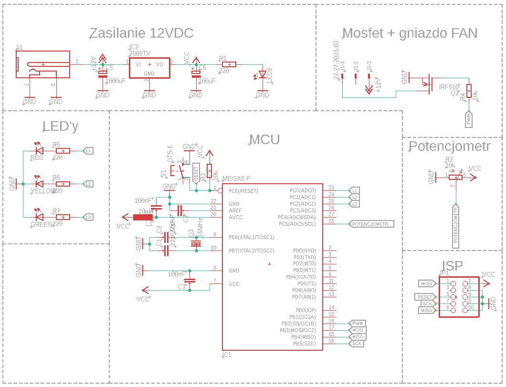
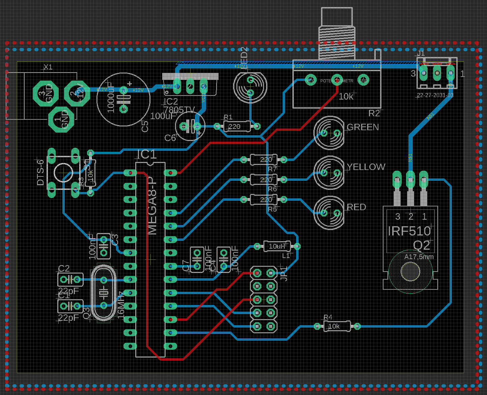

# Projek techniki Mikroprocesorowej 
Sterownik wentylatora komputera
# Opis działania

Podczas kręcenia potencjometrem, który jest odpowiedzialny za zwiększenie szybkości obrotów wentylatora, następuje wskazanie prędkości wentylatora za pomocą 3 diod. Każda z diod(zielona, żółta oraz czerwona) zapala się kolejno wraz z większą prędkością wentylatora. Cały projekt budowy tej konstrukcji został zrobiony w programie Eagle. Zostały zastosowane (tak jak wcześniej wspomniałem) Ledy, sekcja zasilania, na której jest wejście w zakresie 12-5V DC, na które wchodzi stabilizator LM7805, wyjście jest równo 5V, potencjometr oraz sam mikrokontroler Atmega8. Jest również dołączony ISP, który umożliwia zaprogramowanie układu scalonego bez jego demontażu w urządzeniu w którym pracuje.

# Projekt budowy w programie Eagle

# Wygląd płytki:

# Kod programu
```cppp
#include <avr/io.h>
#include <util/delay.h>

#define L1 (1<<PC0)
#define L2 (1<<PC1)
#define L3 (1<<PC2)
#define PWM (1<<PB2)

void init_ADC(){
	ADMUX |= (1 << REFS0);
	ADCSRA |= (1 << ADPS1) | (1 << ADPS0);
	ADCSRA |= (1 << ADEN);
}
void initPWM(unsigned char value) {
TCCR1B = 0b01101011;
OCR1B=value;
}


int main(void){
	DDRC |= L1;
	DDRC |= L2;
	DDRC |= L3;
	DDRB |= PWM;
	int potencjometr=0;
	while(1){
		ADCSRA |= (1 << ADSC);
		loop_until_bit_is_clear(ADCSRA, ADSC);
		_delay_ms(5);
		potencjometr= ADC;
		if(potencjometr<=25){
			initPWM(0);
			if(PINC & L1){
				PORTC ^=L1;
			}
			if(PINC & L2){
				PORTC ^=L2;
			}
			if(PINC & L3){
				PORTC ^=L3;
			}
		}
		else if(potencjometr>25){
			initPWM(potencjometr);
			if(potencjometr<=400){
				PORTC |= L1;
				if(PINC & L2){
					PORTC ^=L2;
				}
				if(PINC & L3){
					PORTC ^=L3;
				}
			}
			else if(potencjometr>400 && potencjometr<=800){
				PORTC |= L1;
				PORTC |= L2;
				if(PINC & L3){
					PORTC ^=L3;
				}
			}
			else{
				PORTC |= L1;
				PORTC |= L2;
				PORTC |= L3;
			}
		}
	_delay_ms(50);
	}


}

```
